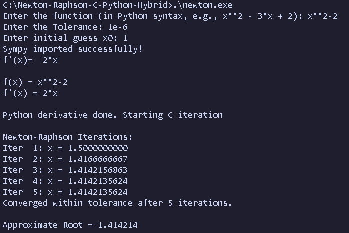

# Newton-Raphson C–Python Hybrid Root Finder

A hybrid implementation of the **Newton-Raphson Root Finding Algorithm** that combines the computational efficiency of **C** with the symbolic mathematics capabilities of **Python (SymPy)**.

Instead of manually deriving mathematical functions, the program automatically computes symbolic derivatives using **SymPy** and performs the Newton-Raphson iterations in **C** using **TinyExpr** for fast numerical evaluation.

---
## Preview

The screenshot below shows the program automatically computing the symbolic derivative using **SymPy** and then performing the **Newton-Raphson iterations** in C until convergence.



## Project Highlights

- Hybrid implementation using **C** and **Python**
- Automatic symbolic differentiation with **SymPy**
- Fast numerical evaluation using **TinyExpr**
- Newton-Raphson iterative root finding
- Demonstrates interoperability using the **Python C API**
- User-defined mathematical expressions
- Displays iteration details until convergence

---

## Technologies Used

- C
- Python
- SymPy
- TinyExpr
- Python C API
- GCC / MinGW
- Visual Studio Code

---

## Project Architecture

```
                User Input
          (Function & Initial Guess)
                     │
                     ▼
              C Application
                     │
       Initializes Python Interpreter
                     │
                     ▼
            Python (SymPy Library)
     Computes Symbolic Derivative
                     │
       Returns Derivative to C
                     │
                     ▼
              TinyExpr Library
     Evaluates f(x) and f'(x)
                     │
                     ▼
      Newton-Raphson Iterations
                     │
                     ▼
              Approximate Root
```

---

## Repository Structure

```
.
├── .gitignore
├── root_n-r.c
├── tinyexpr.c
├── tinyexpr.h
├── Newton_Raphson_Report.pdf
├── Newton_Raphson_PPT.pdf
└── README.md
```

---

## How It Works

1. The user enters a mathematical function.
2. The C program initializes the embedded Python interpreter.
3. Python (SymPy) symbolically differentiates the function.
4. The derivative expression is returned to the C program.
5. TinyExpr numerically evaluates both the function and its derivative.
6. The Newton-Raphson algorithm iteratively computes the root until convergence.

---

## Mathematical Formula

The Newton-Raphson method computes successive approximations using

\[
x_{n+1}=x_n-\frac{f(x_n)}{f'(x_n)}
\]

where

- \(f(x)\) is the function
- \(f'(x)\) is its derivative

The iterations continue until the desired tolerance is achieved.

---

## Sample Input

```text
Function:
x^3 - x - 2

Initial Guess:
1.5
```

## Sample Output

```text
Derivative:
3*x^2 - 1

Iteration 1
x = ...

Iteration 2
x = ...

Iteration 3
x = ...

Approximate Root = 1.52138
```

---

## Documentation

The repository also includes

- 📄 **Newton_Raphson_Report.pdf** — Complete project report
- 📊 **Newton_Raphson_PPT.pdf** — Project presentation

---

## Why a Hybrid Approach?

Traditional implementations require users to manually compute derivatives before applying Newton-Raphson.

This project automates that process by leveraging Python's symbolic mathematics engine while retaining the execution speed of C. The result is a simple yet powerful demonstration of interoperability between programming languages for scientific computing.

---

## Requirements

- Python 3.x
- SymPy
- GCC / MinGW
- TinyExpr
- Python Development Headers

Install SymPy:

```bash
pip install sympy
```

---

## Build

Example compilation command (Windows MinGW)

```bash
gcc root_n-r.c tinyexpr.c -IC:\Python314\include -LC:\Python314\libs -lpython314 -o newton.exe
```

> Adjust the include and library paths according to your Python installation.

---

## Future Improvements

- GUI version
- Graph plotting of functions
- Multiple root-finding algorithms
  - Bisection Method
  - Secant Method
  - Fixed Point Iteration
- Better mathematical expression parser
- Cross-platform build using CMake
- Support for systems of nonlinear equations

---

## Learning Outcomes

This project demonstrates

- Numerical methods
- Symbolic computation
- Embedded Python in C
- Python C API
- Expression parsing
- Scientific computing
- Cross-language interoperability
- Software integration

---

## Author

**Aromal Sajan Madakavil**

B.Tech Mathematics and Computing

University of Petroleum and Energy Studies (UPES)

---

## License

This project is intended for educational and learning purposes.
